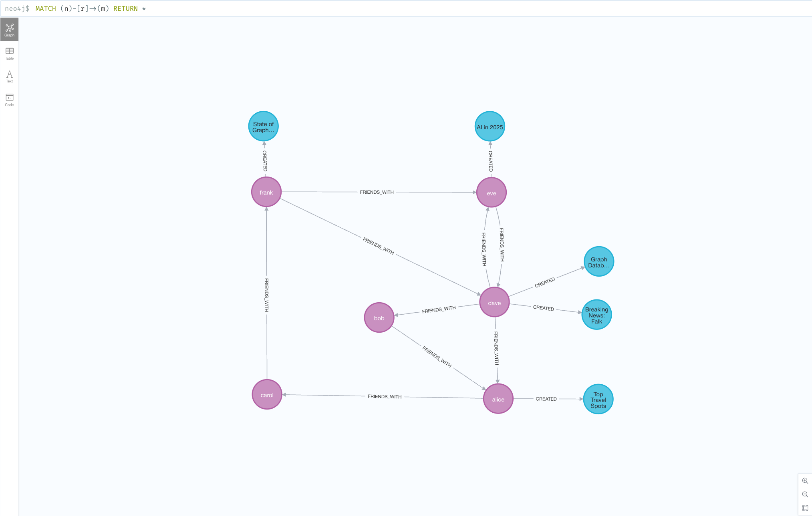
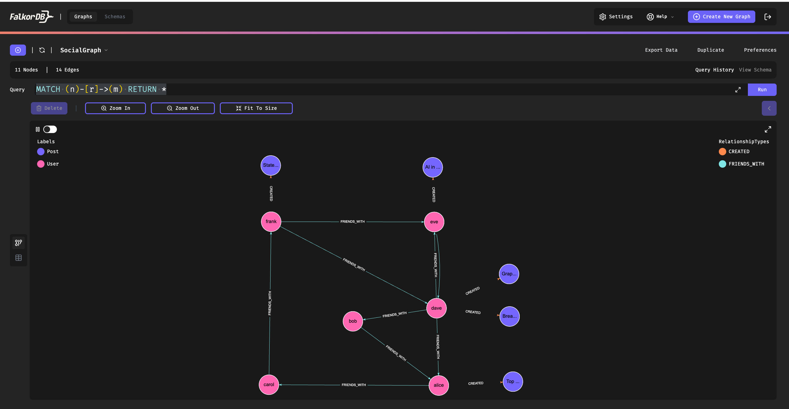

[](https://github.com/falkordb/migrate-neo4j-falkordb)
[](https://github.com/orgs/FalkorDB/discussions)
[](https://discord.gg/ErBEqN9E)

# Migrate from Neo4j to FalkorDB
This repository demonstrates how to **migrate a graph from Neo4j to FalkorDB**.  
It provides scripts to **export from Neo4j**, **transform the data**, **import it into FalkorDB**, and **verify data integrity**. All node labels, relationships, properties, and constraints are preserved.

The workflow is designed for local environments and can be extended to support production systems or cloud deployments.

[](https://app.falkordb.cloud)

---

##  📂 Project Structure

```
migrate.py
data/
  neo4j_data/
  sample_data/
migrate/
  export_from_neo4j.py
  create_falkordb_graph.py
  compare_graphs.py
utils/
  create_neo4j_graph.py
  reset_graphs_and_exported_data.py
  example_run_all.py
```


| File/Folder                           | Description                                                                                       |
|--------------------------------------|---------------------------------------------------------------------------------------------------|
| `migrate.py`                         | Orchestrates the full migration pipeline: export → import → compare                              |
| `data/neo4j_data/`                   | Directory for CSV files exported from Neo4j                                                       |
| `migrate/export_from_neo4j.py`      | Stage I: Exports and transforms data from Neo4j                                                   |
| `migrate/create_falkordb_graph.py`  | Stage II: Builds the FalkorDB graph from exported Neo4j data                                      |
| `migrate/compare_graphs.py`         | Stage III: Compares Neo4j and FalkorDB graphs to confirm parity                                   |
| `data/sample_data/`                 | Optional: Sample CSVs used to generate a Neo4j test graph                                          |
| `utils/create_neo4j_graph.py`       | Optional: Creates a Neo4j graph using the provided sample data                                     |
| `utils/reset_graphs_and_exported_data.py` | Optional: Clears both graphs and removes exported data                                             |
| `utils/example_run_all.py`          | Optional: Runs all stages end-to-end, including reset and sample graph creation                   |


##  Graph Comparison: Before and After Migration
| Neo4j (Source)                                                             | FalkorDB (Target)                                                                       |
| -------------------------------------------------------------------------- | --------------------------------------------------------------------------------------- |
|  |  |


## Setup

### Prerequisites
- Neo4j and FalkorDB must be running locally using Docker
- Your Neo4j instance should already contain data

### Docker Setup For running FalkorDB Locally

```bash
docker run --name my-local-falkor \
  -p 6379:6379 \
  -p 3000:3000 \
  -v "$(pwd)/data/neo4j_data":/var/lib/FalkorDB/import \
  -it --rm falkordb/falkordb:latest
```
Use `-v "$(pwd)/data/neo4j_data":/var/lib/FalkorDB/import` which mounts the local `data/neo4j_data` folder into the FalkorDB container, allowing access to the exported CSVs during import.

---

## Migration Flow

1. Install Python dependencies:
```bash
pip install -r requirements.txt
```

2. Run the main migration script from the root of the project:
```bash
python3 migrate.py
```

3. Follow the prompts to approve each stage of the migration.

This will:
- Export the current Neo4j graph to `data/neo4j_data/`
- Create a FalkorDB by creating nodes, relationships, properties, and constraints (using [LOAD CSV](https://docs.falkordb.com/cypher/load_csv.html))
- Validate that the graphs are equivalent
  
## Adapting to your Use Case 

These scripts are tailored to work with the sample data provided in `data/sample_data/` and serve primarily as a **reference implementation**.  
If you wish to use them with your own Neo4j graph, you will need to **adapt the scripts in the `migrate/` folder** to fit your graph's ontology, such as node labels, relationship types, and property names. See [Editing the Scripts](#-editing-the-scripts-to-your-use-case) 

---

## Handling Temporal Data

FalkorDB **does not** support Neo4j's [temporal types](https://neo4j.com/docs/cypher-manual/current/values-and-types/temporal/) such as `date`, `datetime`, `localdatetime`, etc.  
Instead, FalkorDB expects **timestamps as numbers** — typically **UNIX time** in **microseconds** (or sometimes milliseconds).

In this project:
- All Neo4j `date` and `datetime` fields are **converted to UNIX epoch time** (in microseconds) before being imported into FalkorDB.
- Simple transformation functions like `convert_created_timestamp_to_epoch()` and `convert_friends_with_since_to_epoch()` demonstrate this.

If your source graph includes more complex temporal structures (like durations or timezone-aware datetimes),  
you should extend the transformation logic accordingly before loading into FalkorDB.

---

## Optional: No Existing Neo4j Graph?

<details>
<summary>Expand to create local Neo4j graph:</summary>

### 🐳 Docker Setup For running Neo4j Locally

```bash
docker run \
  --name neo4j-local \
  -p 7474:7474 -p 7687:7687 \
  -v "$(pwd)/data":/import \
  -e NEO4J_AUTH=neo4j/test1234 \
  -e NEO4J_dbms_security_allow__csv__import__from__file__urls=true \
  -e NEO4J_PLUGINS='["apoc"]' \
  -e NEO4J_apoc_export_file_enabled=true \
  -e NEO4J_apoc_import_file_enabled=true \
  -e NEO4J_apoc_import_file_use__neo4j__config=false \
  -d neo4j:5
```

<details>
<summary> Docker Flags Explanation (Neo4j)</summary>

- **`-v "$(pwd)/data":/import`**  
  Mounts the local project's `data/` directory into the Neo4j Docker container under `/import`.  
  Enables Neo4j's APOC procedures (like `apoc.export.csv.*`) to read/write CSV files easily.

- **`-e NEO4J_AUTH=neo4j/test1234`**  
  Sets Neo4j username and password inside the container.

- **`-e NEO4J_dbms_security_allow__csv__import__from__file__urls=true`**  
  Allows importing CSVs from file URLs like `file:///import/sample_data/users.csv`.

- **`-e NEO4J_PLUGINS='["apoc"]'`**  
  Installs the APOC plugin for CSV operations and more.

- **`-e NEO4J_apoc_export_file_enabled=true`**  
  Enables export operations from Neo4j to files.

- **`-e NEO4J_apoc_import_file_enabled=true`**  
  Enables import operations from files into Neo4j.

- **`-e NEO4J_apoc_import_file_use__neo4j__config=false`**  
  Allows APOC to use flexible filesystem paths without strict Neo4j restrictions.

</details>

You can either:
1. Atutomatically run the entire migration by running

```bash
python3 utils/example_run_all.py
``` 
This will:
- Reset the environment (clear Neo4j, FalkorDB, and old CSVs)
- Create a sample Neo4j graph based on sample CSV data
- Perform the full export → import → comparison process

OR

2. Running compleley manually
```bash
python3 utils/reset_graphs_and_exported_data.py
python3 utils/create_neo4j_graph.py
python3 migrate.py
``` 


</details>

---

## ✍️ Editing the Scripts to Your Use Case

<details>
<summary>Expand to overview edit suggestions</summary>

In orderto support a given ontology, edit the scripts in order to create your node labels, relationship types, property names etc'.

Specifically:

1. **export_from_neo4j.py**
   - The queries used to export CSVs (saved to `data/neo4j_data/`) will need to be modified.
   - Functions like `convert_created_timestamp_to_epoch()` and `convert_friends_with_since_to_epoch()` demonstrate simple examples of transforming `date` and `datetime` values.
   - For more complex cases, it is recommended to create a separate `transform.py` to handle all transformations and produce cleaned CSVs before importing.

2. **create_falkordb_graph.py**
   - Queries that recreate the graph in FalkorDB must match your graph's structure.
   - The `create_constraints_from_csv()` function shows an example of applying constraints from CSV; a similar method can be implemented for indexes if needed.

3. **compare_graphs.py**
   - The `comparison_queries` dictionary and the `compare_results()` function are written based on the sample data and will need editing to properly compare your own data.

4. **clean.py**
   - This utility script removes internal Neo4j IDs (`<element_id>`) from the exported CSVs. These IDs help create relationships during import but should be removed afterward for a clean schema.


</details>

## LICENSE

Licensed under the Server Side Public License v1 (SSPLv1). See [LICENSE](LICENSE.txt).

### Support our work

⭐️ If you find this repository helpful, please consider giving it a star!

↗️ Graph, graph database, RAG, graphrag, Retrieval-Augmented Generation,Information Retrieval, Natural Language Processing, LLM, Embeddings, Semantic Search
